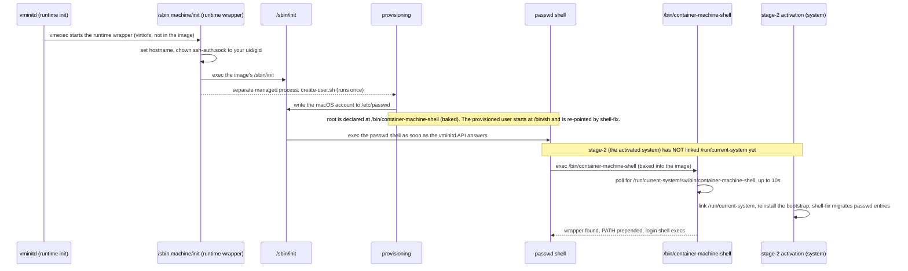

# NixOS Container Machine

Apple's [`container`](https://github.com/apple/container) is a macOS-native
container runtime. Its **Container machine** feature runs each machine as a
lightweight Linux VM: the kernel starts the runtime's own `vminitd`, which
runs the runtime's own `/sbin.machine/init` wrapper, which execs the image's
`/sbin/init` (no bootloader, no kernel in the image).
Any Linux image whose init runs can be a [Container
machine](https://github.com/apple/container/blob/main/docs/container-machine.md);
this repo builds a NixOS image for that purpose.

Builds the OCI archive the NixOS Container machine boots. The image
boots into a **usable, switchable NixOS host** with `nixos-rebuild
switch` working out of the box.

The login user and home come from `container`'s built-in provisioning;
baked-in services give that user a working `PATH` and `sudo`. Your own
configuration (dotfiles or otherwise) is switched in afterwards with an
ordinary `nixos-rebuild switch`.

---

## Use the Prebuilt Image

The fastest way to use this - no clone, no build: pull the published image
and create the machine straight away. The only prerequisite is Apple's
`container` CLI:

```sh
container machine create ghcr.io/ryuheechul/provision/nixos-cm:latest \
  --name nixos --cpus 4 --memory 8G --home-mount rw
container machine run -n nixos
```

The image lives in the GitHub Container Registry, published by the
[workflow](../../../.github/workflows/nixos-container-machine-image.yml)
(runs on demand from the Actions tab). Two tags are published: `latest` and
`sha-<short>` (the commit the image was built from); the package page also
shows a digest for exact pinning. The package is public, so pulling needs
no registry login. Keep `--home-mount rw` only when you use this repo's
Makefile targets (`sync-config`, `switch`) from a checkout against the
machine - drop it otherwise.

Everything below covers what the image is and how to build, launch, and
switch it yourself - for when you want to change the image rather than
just run it.

---

## Key Ideas

What makes it work - each detailed further down:

- **The runtime boots the image's init** - a Container machine boots
  any Linux image whose `/sbin/init` runs; NixOS's systemd qualifies,
  plain container images do not ([Basics](#basics)).
- **A baked shell bootstrap covers the pre-activation window** - the
  runtime execs the passwd shell before stage-2 (the activated NixOS
  system after `switch_root`) has linked `/run/current-system`;
  `/bin/container-machine-shell` waits for the wrapper and hands off
  ([Boot Sequence](#boot-sequence)).
- **The provisioned user is reconciled, not baked in** - no username
  or uid lives in the image; `container` provisioning writes the macOS
  account into a mutable `/etc/passwd` on first boot, and the
  restore-user service plus an activation snippet run after the
  declarative `users` activation on every switch (a bare config
  restores the Apple user, a config that declares the user wins)
  ([User model](#user-model)).
- **Build and switch share one profile** - the generated
  `/etc/nixos/configuration.nix` imports the same
  `virtualisation/docker-image.nix` profile as the image build, so a
  switch never flips defaults.
- **One configuration directory, two modes** - all container-machine
  specifics live in `machine-configuration/`. The same directory
  structure ships **baked into the image** (works out of the box for
  most users) and can be **overlaid imperatively** when you're
  actively developing it. Most users stay baked; the overlay is for
  active tweaking, and [`machine-configuration/flake.nix`](./machine-configuration/flake.nix)
  serves flake-based configurations - the directory is its own flake root, so
  the image copy and the live overlay are both consumable as `path:` inputs
  ([precedence](#configuration-precedence-two-paths-the-later-one-wins)).

## Basics

Apple's **Container machine** is a lightweight Linux VM (not a process
container): Virtualization.framework boots a runtime-supplied guest kernel,
and the image contributes neither kernel nor bootloader. Per the [Container
machine
docs](https://github.com/apple/container/blob/main/docs/container-machine.md),
**any Linux image that includes `/sbin/init` works** - the runtime boots the
image's init system. That is why this repo starts from a NixOS image (its
systemd is `/sbin/init`), and why plain Docker images without an init (e.g.
Debian/Fedora/Ubuntu/Busybox) and container-tool images (such as `nixos/nix`)
do **not** boot as a Container machine - they never exec `/sbin/init`, so they
stall in the runtime's boot loop.

## Comparison: What Each Environment Must Provide

The axis that matters: **who supplies the kernel/bootloader, the init,
and the userland glue around it** - users, DNS, mounts, PATH, sudo. The
more a runtime imposes its own conventions while booting your init, the
more special provisions the image must carry; that is exactly this
repo's situation.

| Environment | Model | How Nix/NixOS arrives | Special provisions to make it work |
| --- | --- | --- | --- |
| Apple [Container machine](https://github.com/apple/container/blob/main/docs/container-machine.md) (this repo) | VM: Virtualization.framework boots a runtime-supplied guest kernel, whose `vminitd` + `/sbin.machine/init` wrapper exec the image's `/sbin/init` - no bootloader and no kernel in the image | Baked OCI image with a switchable `/etc/nixos` | The image supplies what the runtime does not:<br>• boot grafts<br>&nbsp;&nbsp;◦ `/sbin/init`, `/run/current-system`, `/bin` shims<br>&nbsp;&nbsp;◦ pre-activation `/bin` shell bootstrap<br>• environment gaps<br>&nbsp;&nbsp;◦ gateway-based DNS (runtime starts no resolver)<br>&nbsp;&nbsp;◦ direct setuid sudo (`nosuid` `/run`)<br>• user reconciliation<br>&nbsp;&nbsp;◦ runtime-provisioned account, mutable passwd<br>(details: [Boot sequence](#boot-sequence), [Compat shims](#compat-shims)) |
| Regular NixOS VM (VMware, UTM, Parallels, ...) | Full VM: hypervisor boots kernel + bootloader | Official ISO, `nixos-install` | Nothing beyond `hardware-configuration.nix` - the baseline everything else is measured against |
| Nix tools container (`nixos/nix` on Docker/Podman) | Process container: no init; the entrypoint is PID 1 | Nix preinstalled in the image | Nothing boot-related:<br>• no systemd, no activation, no NixOS host<br>&nbsp;&nbsp;◦ a toolbox, not a system container |
| LXC | LXC: system container pioneer - uses a layered rootfs + config template to boot init; Apple's Container machine drops the layer/template abstraction and boots your `/sbin/init` straight from the OCI image. Most users encounter it via [Proxmox](https://proxmox.com) or [Incus](https://linuxcontainers.org/incus/). | NixOS rootfs template | • host setup<br>&nbsp;&nbsp;◦ template + AppArmor config<br>• user namespaces<br>&nbsp;&nbsp;◦ unprivileged runs need subuid/subgid id mappings |
| OrbStack | Light Linux machine VMs + Docker containers (a NixOS guest gets its own `/etc/nixos/incus.nix` and `/etc/nixos/orbstack.nix`, both imported by `/etc/nixos/configuration.nix` - see [OrbStack](#field-notes-installing-nixos-on-each-platform) (e) for what that does and does not prove) | NixOS is a first-class distro (`orbctl create nixos`), or the official Nix installer on a stock distro | • stock-distro path: no image grafts - the OS is the stock distro, not NixOS<br>• OrbStack provisions the user |
| Lima | VM (QEMU / Virtualization.framework) + cloud-init | Official Nix installer on the stock template; Lima has **no official NixOS support** - [nixos-lima/nixos-lima](https://github.com/nixos-lima/nixos-lima) generates NixOS images + a Lima guest module instead | • stock-VM rules<br>&nbsp;&nbsp;◦ cloud-init provisions user and mounts<br>• NixOS via nixos-lima<br>&nbsp;&nbsp;◦ boot-time userdata config + `lima-guestagent` service |

## Field Notes: Installing NixOS on Each Platform

The table above describes the technical model; this is what it feels like in practice **as I tried most of them - except Lima + NixOS**.

**a) Bare metal (USB installer)**
The canonical path. Boot the ISO, run `nixos-install`, provide `hardware-configuration.nix`. You own the bootloader, kernel, and partitioning. The [NixOS wiki](https://wiki.nixos.org/) covers most edge cases (encrypted root, ZFS, multiple disks, etc.). Best for: learning the full stack, production servers, when you need hardware passthrough.

**b) VM via UTM / virt-manager / Proxmox / Incus**
All full VMs - hypervisor boots kernel + bootloader. Same installer flow as bare metal (`nixos-install` or ISO), just virtualized.

- **UTM** (macOS): frictionless for Apple Silicon, SPICE/VNC, easy snapshots
- **virt-manager / Proxmox** (Linux): SPICE/VNC, snapshots, PCI passthrough, cluster integration
- **Incus VMs**: `incus launch images:nixos/26.05 --vm` - fast spin-up, integrated networking/storage

Best for: CI, throwaway test clusters, GUI apps via SPICE, when you need a real kernel/bootloader.

**c) Lima (I have not tried with NixOS yet)**
Lima runs VMs via QEMU/Virtualization.framework + cloud-init, but the experience is **container-like**: no manual install step, no partitioning. You `limactl start <template>` and get a running Linux in seconds - by default Lima downloads a **pre-built disk image** (qcow2/raw, fetched from distro cloud-image repositories like Ubuntu, Fedora, Alpine, etc.), and cloud-init handles user, SSH keys, mounts, and DNS on first boot. (ISO boot does exist - `limactl start alpine-iso` - but it's the exception, not the default path.) It pioneered the **WSL2-style experience on macOS** (and Linux): declarative YAML config, automatic port forwarding, filesystem sharing (`mountType: virtiofs`/`sshfs`), and `lima` CLI that feels like `docker`/`podman`.

No official NixOS support - the community maintains [nixos-lima/nixos-lima](https://github.com/nixos-lima/nixos-lima) (prebuilt images + `lima-guestagent` service). Workflow: `limactl start github:nixos-lima` → cloud-init provisions user/SSH/mounts → `nixos-rebuild switch` inside.

I've used Lima for Ubuntu/Fedora; the cloud-init model is clean but adds a layer vs. raw VM.

Best for: macOS users who want a VM that feels like a cloud instance (declarative config, instant boot, host integration).

**d) LXC via Proxmox / Incus / Colima (via Incus)**
System containers - no kernel, no bootloader. You start from a **rootfs template**:

- **Proxmox**: `pveam` has no NixOS template, so grab the prebuilt LXC tarball from Hydra instead of building it - [nixos.proxmoxLXC.x86_64-linux](https://hydra.nixos.org/job/nixos/release-26.05/nixos.proxmoxLXC.x86_64-linux/latest) (product `nixos-image-lxc-proxmox-*.tar.xz`); drop it in the storage's template dir (e.g. `/var/lib/vz/template/cache/`), then create via UI or `pct create ... -ostype unmanaged`
- **Incus**: `incus launch images:nixos/26.05` (scriptable CLI)
- **Colima**: `colima start --runtime=incus` then `incus launch...` (incus experience on macOS)

The template gives a minimal NixOS rootfs; you `nixos-rebuild switch` inside to make it yours.

Caveats:
- Unprivileged containers need `subuid`/`subgid` mapping on the host
- `nixos-rebuild` needs `CAP_SYS_ADMIN` + loop devices (AppArmor/profile tweaks)

**Why system containers**: they share the host kernel, so you skip the VM overhead (no guest kernel, no bootloader, no firmware). This makes them far lighter - you can run dozens on hardware where a handful of full VMs would strain resources. The trade-off: no custom kernel, no kernel modules, and you depend on the host's kernel version/features.

Best for: density (dozens of NixOS "machines" on one host), fast iteration, when you don't need a custom kernel; when you want `nixos-rebuild switch` and a system layer (init, services, users) that typical OCI containers (Docker/Podman) don't provide - by design.

**e) OrbStack**
OrbStack provides NixOS out of the box - select it from the [machine distros list](https://docs.orbstack.dev/machines/distros). How it works under the hood is my guess, not a documented fact: a fresh machine ships `/etc/nixos/incus.nix` and `/etc/nixos/orbstack.nix` imported by `/etc/nixos/configuration.nix` alongside `virtualisation/lxc-container.nix`, and `systemd-detect-virt` answers `lxc`, which reads like an LXC system container rather than a full VM. OrbStack's own [architecture docs](https://docs.orbstack.dev/architecture) say something different: a *"lightweight Linux virtual machine with a shared kernel"*, similar to WSL 2, whose services are *"purpose-built from scratch … instead of using off-the-shelf programs"* - no Incus named anywhere, and no Incus binary ships in the app bundle. Weigh both. Either way you get a NixOS VM-like experience with `nixos-rebuild switch` working immediately, and OrbStack handles user provisioning, Rosetta, and VirtIO integrations natively. Best for: macOS developers who want a zero-config NixOS host alongside Docker.

**f) Apple Container machine (this repo)**
The runtime's `vminitd` reaches the image's `/sbin/init` - no bootloader, no kernel in the image, no cloud-init.

Boot detail: the kernel's `init=` is `/sbin/vminitd`, which lives on a runtime-provided initfs disk (`/dev/vda`, ~640 MB, also holding `vmexec`), not in the image. It mounts the image rootfs (`/dev/vdb`), serves a gRPC API over vsock, and starts `vmexec`. `vmexec` then runs the runtime's own wrapper `/sbin.machine/init` - a read-only virtiofs mount from the host's `plugin-state/machine-apiserver/machines/<name>/sbin.machine`, not a file in the image. That wrapper sets the hostname, chowns the forwarded `ssh-auth.sock` to your macOS uid/gid, then `exec`s the image's `/sbin/init`. So **two** init stages sit outside the image before systemd takes over as PID 1:

- proof - `/proc/1/environ` still carries the wrapper's exports (`CONTAINER_*`, `CONTAINER_SHELL`); `CONTAINER_SHELL` appears in no host binary and is set only by that script
- provisioning - a second managed process runs right after the init chain, **before stage-2 activation**: the first boot's `/etc/sudoers.d/<user>` mtime lands inside its window, ahead of the `booting system configuration` line, so the account comes from `create-user.sh` (which appends the passwd/group/shadow lines and that sudoers rule) rather than from any image or activation step
- the same script's marker, `/etc/.machine.initialized`, is a host-backed virtiofs file rather than image state, so it keeps its first-boot mtime across reboots

One consequence: `/etc/hostname` is a NixOS symlink, so the wrapper's hostname write loses to activation - the machine ends up `container-machine-nixos`, not the `nixos` id the wrapper wrote.

This repo bakes a NixOS OCI image with:
- `/sbin/init` → systemd
- Grafts: `/run/current-system`, `/bin` shims, pre-activation shell bootstrap (so the runtime's early shell exec works)

Flow: `container machine create` → `container machine run` → shell as your macOS user (provisioned at first boot) → `sudo nixos-rebuild switch`.

No template, no layer stack, no cloud-init - just an OCI image with a working init.

**Where it sits**: like **Lima**, you get instant boot + host integration (user, home, DNS via gateway, `sudo`) without manual install, and like **LXC/OrbStack** you ship no kernel in the image - but unlike those system containers, the kernel is not the macOS host's: Virtualization.framework boots a separate guest kernel (`~/Library/Application Support/com.apple.container/kernels/vmlinux-6.12.28-153`). You `nixos-rebuild switch` to make it yours. The difference: Apple's runtime uses a **single OCI image + direct init exec** - no template layer stack, no cloud-init, no Incus daemon. It's the most minimal VM path on macOS.

**Why this path**: for most other methods (OrbStack, Lima, Incus, Proxmox), you rely on a provided solution - someone else built the image, the template, the integration. With Apple's Container machine, it's **still early (2026)**: you build the OCI image yourself, you wire the compat layer (the **adapters** that bridge runtime quirks - the pre-activation shell bootstrap, gateway DNS, direct `sudo`, user reconciliation), and you learn how the pieces fit. The payoff: **performance and resource efficiency** - a minimal VM (no kernel/bootloader in the image, no daemon, no template layer stack, no cloud-init). Just an OCI image that boots straight to your init. The "adapters" are few and surgical; once in place, the system runs lean.

Best for: one of the interesting choices for running NixOS on macOS - you build the image, wire the adapters, and get a lean VM that boots straight to init.

---

## Flow: Build -> Create -> Switch

Each script under [`bin/`](./bin) resolves its own paths, so you can run them
from any directory. The image is aarch64-linux, so macOS cannot build it
natively; `build-on-container.sh` does the build inside an Apple `container`
sandbox, and `build.sh` works from any Linux box with nix.

```sh
bin/build-on-container.sh    # build the OCI archive in an Apple `container` sandbox
# or: bin/build.sh           # any Linux box with nix
bin/launch.sh                # load the image + create the machine (create-if-missing)
container machine run -n nixos   # shell in - as the macOS account (e.g. heechul)
```

The [Makefile](./Makefile) wraps those scripts as convenience targets
(`make build`, `make launch`, `make run`, `make recreate`, ...); it is run from
this directory.

```sh
cd apple/container-machine/nixos
make build          # bin/build-on-container.sh
make launch         # bin/launch.sh
make run            # shell in - user, home, and PATH all work
```

That's it for a usable host. If the image archive already exists, the build
asks before replacing it; use `FORCE_BUILD=1` (e.g.
`FORCE_BUILD=1 bin/build-on-container.sh`) for non-interactive rebuilds. The
machine user is the macOS account that created the machine; `/home/<user>` is
created and persisted by `container` automatically.

To apply your dotfiles - inside the guest as that user, with `sudo`
working:

```sh
# inside the guest (container machine run -n nixos)
# the image is dotfiles-agnostic: any NixOS configuration works with it -
# the clone below is just a real-world example that is known to work
git clone https://github.com/ryuheechul/dotfiles ~/dotfiles  # or use the host mount
~/dotfiles/bootstrap/foundation/nixos/switch.sh   # gen-configuration + nixos-rebuild switch
# or directly: sudo nixos-rebuild switch
```

For fast iteration on the guest configuration, update the running
machine without building a new image:

```sh
make sync-config       # write machine-configuration/ as the live overlay
make switch            # sync it, then run nixos-rebuild switch
```

These targets use the host home mount, so run them from this directory and keep
the machine's `--home-mount rw` setting. Rebuild the image only when the boot
image itself needs to change.

That example repo's `bootstrap/foundation/nixos/switch.sh` does `gen-configuration.sh`
(`username=$(whoami)` + `user.nix {username}`) and `nixos-rebuild.sh`
(`NIX_PATH` via `niv` + `nixos-rebuild switch` via `sudo`). After the
first switch the user is declarative (`users.users.<name>` via
`user.nix`).

### Example Configurations (for Testing switch)

[`examples/`](./examples) holds two minimal configurations, so switching can be
exercised without writing your own. The example files are read from the host
mount, and each one switches against either base - the live overlay or the
image's baked copy - one target per base:

```sh
make switch-nonflake         # examples/nonflake, base = live overlay
make switch-nonflake-baked   # examples/nonflake, base = image copy (parks overlay in .bak)
make restore-config          # brings the parked overlay back
make switch-flake            # examples/flake, cm = image copy (.baked)
make switch-flake-live       # examples/flake, cm = live overlay
make switch                  # back to the machine's own machine-configuration overlay
```

- [`examples/nonflake/configuration.nix`](./examples/nonflake/configuration.nix)
  is the shape a dotfiles configuration has (`imports = [
  /etc/nixos/configuration.nix ]`) and switches through the channel +
  `NIX_PATH`, exactly like `make switch`. It declares no base of its own:
  `configuration.nix`'s precedence picks it, so `switch-nonflake` syncs the
  overlay first (live wins) and `switch-nonflake-baked` parks it at
  `machine-configuration.bak` instead of deleting it - precedence then falls
  back to the image copy, and `make restore-config` brings the park back.
- [`examples/flake/`](./examples/flake) is a flake configuration. A flake never
  reads `/etc/nixos/configuration.nix`, so the same base comes from
  [`machine-configuration/flake.nix`](./machine-configuration/flake.nix)'s
  `nixosModules.default` instead: the example's `cm` input is
  `path:/etc/nixos/machine-configuration.baked`, the copy the image grafts -
  a real directory, so testing it needs no push and no network for `cm`.
  Two alternatives sit beside it as commented lines, ready to uncomment: the
  live overlay `path:/etc/nixos/machine-configuration` (tracks your edits,
  written by [`make switch`](#host-side-workflow-this-directory)), and the URL
  for consuming this flake from outside the machine,
  `github:ryuheechul/provision?dir=apple/container-machine/nixos/machine-configuration`.
  `switch-flake-live` takes the live path without editing anything - it passes
  `--override-input cm path:/etc/nixos/machine-configuration`, which never
  touches `flake.lock`. That lock is gitignored (see the comment in
  [`examples/flake/.gitignore`](./examples/flake/.gitignore)): it pins the NAR
  hash of the baked directory, and that content changes on every image
  rebuild, so a committed lock would make `switch-flake` fail with
  `NAR hash mismatch` on the next machine (or silently serve the old content
  on a warm store). Each machine writes its own on first use; after an image
  rebuild + recreate, refresh a stale lock with `nix flake update cm` in
  `examples/flake`, or delete it and let the next switch recreate it.
- Upstream gives flake-built systems a `NIX_PATH` without `nixos-config`, which
  would break `make switch` after `make switch-flake`; this machine opts out of
  that through `nixpkgs.flake.setNixPath` in
  [`machine-configuration/nix.nix`](./machine-configuration/nix.nix).

## Boot Sequence

First boot, and every login shell after it, run through this chain. The
timing in the middle - the runtime starting shells before NixOS
activation - is the quirk every other shim works around:



The PATH wrapper lives behind `/run/current-system`, which does not
exist yet at exec time, so the bootstrap is grafted into the image at
`/bin` (independent of `/run`) and reinstalled by every activation; it
polls, then hands off unchanged. `container-machine-shell-fix` (a boot
service, mirrored as an activation snippet so a switch migrates
immediately) re-points the initial `/bin/sh` entry - and the legacy
pre-bootstrap `/run/current-system/...` entry written by older
configurations - at the bootstrap, rewriting only those two shapes so
declarative shells stay untouched. The wrapper prepends
`/usr/local/bin:/run/wrappers/bin:/run/current-system/sw/bin` to the
PATH, so `git`, `curl`, `nix`, and direct `sudo` resolve from the
system profile or the persistent root filesystem (where
`/usr/local/bin/sudo` lives).

## Statefulness and Safety

A machine is **stateful**: `/home/<user>` and anything switched in persist
on its disk (`rootfs.ext4`).

- `make launch` / [`bin/launch.sh`](./bin/launch.sh) is **create-if-missing** - an existing
  machine is never touched.
- The only operations that remove a machine - and destroy its persisted
  state - are `make recreate` and `make delete` (both destroy state; both confirm);
  each **asks for confirmation** first.
- `make clean` removes transient build artifacts + the loaded image and
  runs `container prune` (**all** stopped containers - the CLI has no
  name/label filter). The running machine is not touched.

## Files

### [`image/`](./image) - packaging that defines the image

- [`image/default.nix`](./image/default.nix) - entry point (`nix-build image -A image`): imports `machine-configuration/` and wires the modules below.
- [`image/common.nix`](./image/common.nix) - shared platform facts (`ociArchitecture`, `tarFlags`), static file contents, and OCI JSON templates (`builtins.toJSON`).
- [`image/rootfs.nix`](./image/rootfs.nix) - unpacks the system tarball, grafts the Container machine boot bits (`sbin/init -> /init`, `/run/current-system -> /`, `/bin` shims), packs the bare rootfs tarball.
- [`image/oci.nix`](./image/oci.nix) - assembles the minimal single-layer OCI archive and the Dockerfile build context (**manual fallback** via `make build-context`, not used by `make build`).
- [`image/bin/`](./image/bin) - shell bodies for the rootfs/OCI derivations (`make-rootfs.sh`, `pack-oci-image.sh`, ...), driven by Nix-provided env vars (shellcheck-friendly; not under the gitignored `build/`).

#### Packaging Paths

Two ways to get the same rootfs into a `container` image tag:

| | **OCI archive (default)** | **Dockerfile context (fallback)** |
|--|---------------------------|-----------------------------------|
| Make target | `make build` | `make build-context` |
| Output | `build/nixos-machine-image.tar` (OCI layout) | `build/build-context/` (`Dockerfile` + `rootfs.tar.xz`) |
| How the image is produced | Nix packs the archive; `container image load` | `container build` applies the Dockerfile |
| Status | Default path used by `make launch` | Manual fallback if `image load` misbehaves; less tested |
| Then | `make launch` | `cp -L build/build-context /tmp/ctx && cd /tmp/ctx && container build -t local/nixos-cm .` |

Same guest `rootfsTree` either way; only packaging and how `container` ingests it differ.

### [`machine-configuration/`](./machine-configuration) - guest system definition

- [`machine-configuration/default.nix`](./machine-configuration/default.nix) - entry: identity (`stateVersion`, `hostName`), shared packages; generates the self-staged `configuration.nix` (parallel to NixOS's `hardware-configuration.nix`) that picks between the two configuration paths described below, and imports the modules below. The generated `configuration.nix` imports `virtualisation/docker-image.nix` - the same profile as the image build, so a switch does not flip defaults (`lxc-container.nix` was rejected; see the comment there).
- [`machine-configuration/networking.nix`](./machine-configuration/networking.nix) - systemd-resolved + `runtime-gateway-dns`, firewall off, `useHostResolvConf` override.
- [`machine-configuration/shell.nix`](./machine-configuration/shell.nix) - `container-machine-shell` PATH wrapper, the `/bin/container-machine-shell` wait-for-`/run/current-system` bootstrap it hands off to, shell-fix service, `USER`/`LOGNAME` profile hooks.
- [`machine-configuration/sudo.nix`](./machine-configuration/sudo.nix) - direct setuid sudo, pam_permit rule, sudo-fix service.
- [`machine-configuration/users.nix`](./machine-configuration/users.nix) - mutable passwd, restore-user service + activation script (Apple-provisioned account).
- [`machine-configuration/runtime.nix`](./machine-configuration/runtime.nix) - boot quirk: `postBootCommands` (`/run/systemd` before systemd starts).
- [`machine-configuration/nix.nix`](./machine-configuration/nix.nix) - Nix feature defaults for bare `nixos-rebuild switch` (`experimental-features`); channel and `NIX_PATH` come from upstream `nix.channel.enable` / `nix.nixPath` defaults via `/etc/set-environment`, which `make switch` sources instead of hardcoding.

#### Configuration Precedence: Two Paths, the Later One Wins

The generated `/etc/nixos/configuration.nix` imports, in order of
preference:

1. `/etc/nixos/machine-configuration` - the **live overlay**: a real
   directory written only by `sync-config` (hence by every `make switch`).
   Present -> it wins. `make switch-nonflake-baked` parks it at
   `machine-configuration.bak` to fall back (`make restore-config` moves it
   back); `rm -rf` in the guest removes it outright.
2. `/etc/nixos/machine-configuration.baked` - the **baked** copy grafted
   into the image by [`image/bin/make-rootfs.sh`](./image/bin/make-rootfs.sh)
   from this same tree. Used on a fresh machine (before any sync) and after
   the overlay is removed; changes only when the image is rebuilt.

`make status` prints which one is active (`config source: overlay|baked`).
The overlay is deliberately not an `environment.etc` entry: two writers for
one path is what made `setup-etc` warn on every switch, and activation must
never delete the live copy.

### Host-Side Workflow (This Directory)

- [`bin/build.sh`](./bin/build.sh) - `nix-build image -A image` (run on any Linux box with nix - lima VM, ARM Linux, CI). The `build/` output is a symlink into `/nix/store`, so it copies a real `build/nixos-machine-image.tar` next to it.
- [`bin/build-on-container.sh`](./bin/build-on-container.sh) - build the image inside an Apple `container` sandbox running `nixos/nix` (no Lima VM, works from macOS). Two network entrances: `default` (normal) or `CONTAINER_BUILD_NETWORK=fresh` (when the default vmnet NAT has no outbound connectivity, e.g. a VPN/Tailscale default-route conflict). Mounts this dir into the guest, builds, and copies the real archive back; the guest `/nix/store` is ephemeral. Runs the sandbox with `--rm`, so a finished build leaves **no stopped container** behind and leaks no host disk. Passes `--memory 6G` because the NixOS tarball assembly OOMs at the default limit (tune with `CONTAINER_BUILD_MEMORY`).
- [`bin/build-guard.sh`](./bin/build-guard.sh) - prompts before replacing an existing image archive; set `FORCE_BUILD=1` for non-interactive rebuilds.
- [`bin/launch.sh`](./bin/launch.sh) - macOS side: `container image load --input build/nixos-machine-image.tar` + `container machine create` (name `nixos`), **create-if-missing**; `--recreate` asks before destroying. After creating, it waits up to 30s for the guest to reach `running` before printing shell-in hints; if the state is still unknown it says so and points at `make status` instead.
- [`machine-configuration/flake.nix`](./machine-configuration/flake.nix) - the consumable flake: `nixosModules.default` carries the container profile + this module tree. The directory is its own flake root, so it is consumed from inside the machine as `path:/etc/nixos/machine-configuration.baked` (image copy; the live overlay is the alternative) - see [examples/flake](./examples/flake) - and from outside by URL.
- [`examples/`](./examples) - the minimal non-flake and flake configurations switched with `make switch-nonflake` / `make switch-flake`.
- [`Makefile`](./Makefile) - convenience entry point wrapping the scripts (`make build`, `make launch`, `make run`, `make recreate`, ...), run from this directory. Secondary packaging path: `make build-context` (Dockerfile fallback).

The image is aarch64-linux, so macOS cannot build it natively.

## User Model

The image initially manages no user declaratively - `container`'s own
provisioning (host-side `/sbin.machine/create-user.sh`, not image content,
run once at first boot) writes the
macOS account into `/etc/passwd` as `user:uid:gid::/home/<user>:shell`,
creates and persists `/home/<user>` (a plain, empty, normal-Linux home -
not bridged to the mounted macOS `/Users/<user>`). After the first
`nixos-rebuild switch` with your dotfiles, that user becomes declarative
via `nix/nixos/user.nix` (`users.users.<name>` + `wheel` + `zsh`). No
username or uid is hard-coded in the image - the boot services find the
user from the `create-user.sh` sudoers marker.

That user's shell starts as a bare `/bin/sh` with no PATH to the NixOS
profile. `container-machine-shell-fix` re-points that initial entry
(and the legacy pre-bootstrap one) at the `/bin` bootstrap; root's
shell and the restored machine-user entry point there too - see
[Boot sequence](#boot-sequence) for the mechanics and the
[compat shims](#compat-shims) table for the full fix list. A companion
`container-machine-sudo-fix` service installs direct sudo. Apple
provisioning owns `/etc/sudoers.d/<user>` and supplies the initial
`NOPASSWD` rule, while downstream NixOS configurations remain free to
replace it. The user reconciliation also runs as a NixOS activation
script after the declarative `users` activation: a bare configuration
restores the Apple user, while a dotfiles configuration that declares
the user leaves it unchanged.

`container machine run` (non-root) shells in as the macOS account (e.g.
`uid=501(alice)`); root work goes through `container machine run --root`
or `sudo` inside the guest. The session gid may show the runtime's `lp`(20)
rather than the `users`(100) group - a runtime quirk with no functional
impact (home access works).

## Compat Shims

A [Container machine](https://github.com/apple/container/blob/main/docs/container-machine.md) is not an ordinary NixOS host; both the image
config and the persistent `/etc/nixos/configuration.nix` carry shims so the
guest stays healthy (the latter survives `nixos-rebuild switch`):

| Concern | Fix |
| --- | --- |
| Bare PATH on every exec (runtime shadows `/bin/sh`) | Shells point at `/bin/container-machine-shell`, a bootstrap baked into the image (and reinstalled each activation) that waits for `/run/current-system` - unlinked when the runtime execs the passwd shell - then hands off to the `container-machine-shell` PATH wrapper (see [Boot sequence](#boot-sequence)) |
| NixOS needs a DNS resolver the runtime doesn't start | `services.resolved.enable` runs systemd-resolved; `runtime-gateway-dns` points it at the default-route gateway, which is the runtime's resolver (Apple hands the vmnet gateway to guests as nameserver; macOS `mDNSResponder` listens on `:53` there). No nameserver/IP is hardcoded because the vmnet subnet varies by context (unprivileged `192.168.64.0/24`, root `192.168.2.0/24`, or a custom `container system property set network.subnet`). No DHCPv4 server answers on this link (verified: dhcpcd solicits, gets no offer, falls back to IPv4LL). The link is not silent, though: dhcpcd gets an RA carrying RDNSS (`nd1_rdnss1_servers=fe80::...%eth0`) and a DHCPv6 `REPLY6` (`reason=INFORM6`, no DNS in it). dhcpcd still cannot apply the RDNSS (`Failed to set DNS configuration: Access denied`, because systemd-resolved owns `resolv.conf`), so the gateway remains the only resolver systemd-resolved ends up with. `networking.useHostResolvConf` is turned off (systemd-resolved requires it) at an override priority a downstream plain assignment can beat |
| `nosuid` `/run` and unsupported capability probing | A direct setuid copy of `sudo` is installed at `/usr/local/bin/sudo` on the persistent root filesystem; NixOS capability wrappers are disabled |
| Container-created user can't reach nix tools / `sudo` | `container-machine-shell-fix` re-points its shell at the `/bin` bootstrap (which hands off to the PATH wrapper); Apple provisioning supplies the sudoers rule and `container-machine-sudo-fix` installs direct sudo |
| Locked Apple user fails PAM account checks | The sudo account rule uses `pam_permit` because `NOPASSWD` skips authentication but does not bypass `pam_unix` account validation; downstream configurations can replace this compatibility rule by setting `security.pam.services.sudo.rules.account` |
| Legacy `nixos-rebuild` needs a nixpkgs path | Upstream `nix.channel.enable` + `nix.nixPath` defaults provide it through `/etc/set-environment` (login shells load it; `make switch` sources it explicitly). Downstream configurations can override `nix.nixPath` and the Makefile picks the change up automatically |
| Nix daemon access and feature defaults | Only `root` is trusted by default; `nix-command` and flakes are enabled as defaults so downstream configurations can replace them |

## Prior Art

Image construction is adapted from
[paulsmith/nixos-container-machine](https://github.com/paulsmith/nixos-container-machine):
the evaluation-to-tarball-to-rootfs route (NixOS evaluation +
`system.build.tarball` unpacked and grafted with `/sbin/init`,
`/run/current-system`, and `/bin` shims), the shared
`virtualisation/docker-image.nix` profile, the `container-machine-shell`
PATH wrapper, and the OCI-archive vs Dockerfile-context packaging
duality all come from upstream.

It diverges from there: non-flake (`nix-build image`, built inside an
Apple `container` sandbox instead of nix-darwin with a
[rosetta builder](https://github.com/cpick/nix-rosetta-builder)),
concern-module guest config, the compatibility layer this runtime needs
(pre-activation shell bootstrap, DNS and direct-sudo shims), the
two-path configuration, and the Make-driven sync/switch workflow.
Upstream stays flake-first: a flake template, `nix run .#create`, and
`lib.mkContainerMachine` for other flakes to consume.

## Build Output

`build/` (gitignored) holds `build/nixos-machine-image.tar` and the nix `result` symlink. The .tar is a few hundred MB; rebuild at any time with [`bin/build-on-container.sh`](./bin/build-on-container.sh), [`bin/build.sh`](./bin/build.sh), or `make build`.

## Disk Footprint

The machine's writable root (including `/home/<user>` and the guest Nix store) is an **ext4 disk image** presented as `/dev/vdb` and stored at:

```
~/Library/Application Support/com.apple.container/plugin-state/machine-apiserver/machines/<name>/rootfs.ext4
```

Observations (verified 2026-08):

- The image is **thin-provisioned** (sparse): logical size ~513 GiB, real host allocation only what's used.
- Writing files **grows** the image on the host; deleting them in the guest frees space *inside* the guest filesystem but does **not** shrink the host file on its own.
- `fstrim` **does** reclaim host disk for freed blocks (guest TRIM propagates to a host hole-punch):

  ```sh
  container machine run -n nixos --root 'fstrim -v /'
  ```

  Only *free* blocks are reclaimed (delete first, then trim). Disk usage is otherwise monotonic until the machine is deleted.

## Clean Up

Remove the transient/generated artifacts + loaded image + all stopped
containers via `container prune` (no filter; machine stays usable):

```sh
make clean        # rm build/ + loaded image + `container prune` (ALL stopped); machine left intact
```

Delete the machine and its persisted state (build/load it again via `make build
&& make launch`):

```sh
make recreate     # delete + recreate (confirms)
make delete       # delete without recreating (confirms)
```
