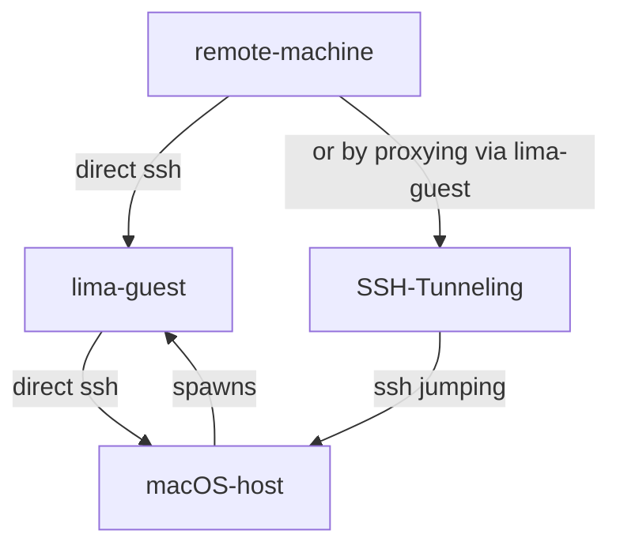

# tailscale
A sole purpose of this machine is to run tailscale.

Why?

Tailscale on macOS [seems to disconnect](https://github.com/tailscale/tailscale/issues/594) when switching user account. Thus, unreliable.

Using this lima vm + `ssh host.lima.internal` from the vm should allow to workaround that situation.

## Provision

> installing tailscale is taken care by [config.yaml](./config.yaml)

`LIMA_INSTANCE=my-tailscale make start`

## Access
> in case exited the shell
`LIMA_INSTANCE=my-tailscale make enter`

## Run Tailscale

```bash
# inside the vm
$ sudo tailscale up
# or
$ make tailscale
```

### More commands
at [Makefile](./Makefile)


### Access Mac Host From a Remote Machine

#### Diagram


```ssh-config
# given ~/.ssh/config on a remote machine
# (being used to connect the macOS host running lima guest)
# with following example config

Host actual-host
	HostName host.lima.internal # perspective from lima
	ProxyJump remote-lima-guest
	User my-username

# since tailscale is running on this layer
Host remote-lima-guest
  # should match to the name in your tailscale, alternatively use ip
	HostName lima-my-tailscale
	User my-username
```

`ssh remote-lima-guest` should let you connect to the lima guest directly given the lima guest and remote machine both are connected by tailscale.

`ssh actual-host` should let you connect to the macOS host via lima-guest by [SSH Tunneling](https://wiki.gentoo.org/wiki/SSH_jump_host)

> adding a public key of the remote machine to `~/.ssh/authorized_keys`, would let you avoid typing password of the account of the target machine

### Caveats
resource spec at [./config.yaml](./config.yaml) is still probably an overkill and not terribly optimized yet.
